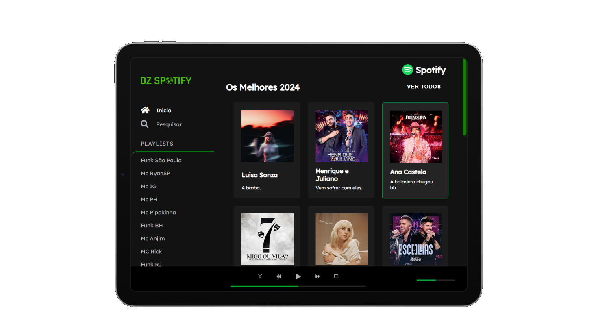

# Spotify Project NUI

## Descrição
### O Spotify Project NUI é um projeto de interface de usuário (UI) inspirado no design da interface do Spotify. Ele foi desenvolvido utilizando HTML e CSS para criar uma experiência visual semelhante à do aplicativo Spotify.

###
###
# Funcionalidades
- Interface de usuário semelhante ao Spotify.
- Reprodução de áudio.
- Navegação entre diferentes seções (como playlists, álbuns, artistas, etc)

###
###
# Como usar
#### 1. Faça o download ou clone o repositório.
#### 2. Abra o arquivo index.html em seu navegador da web.
#### 3. Navegue pela interface clicando nos diferentes elementos, como playlists, álbuns e artistas.

##

# Preview do Arquivo 
